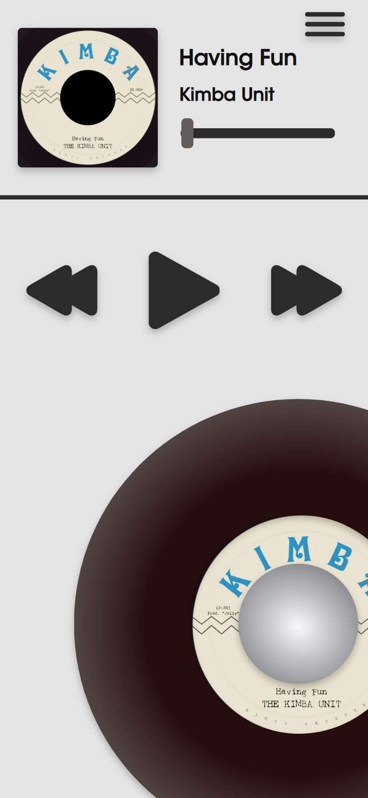
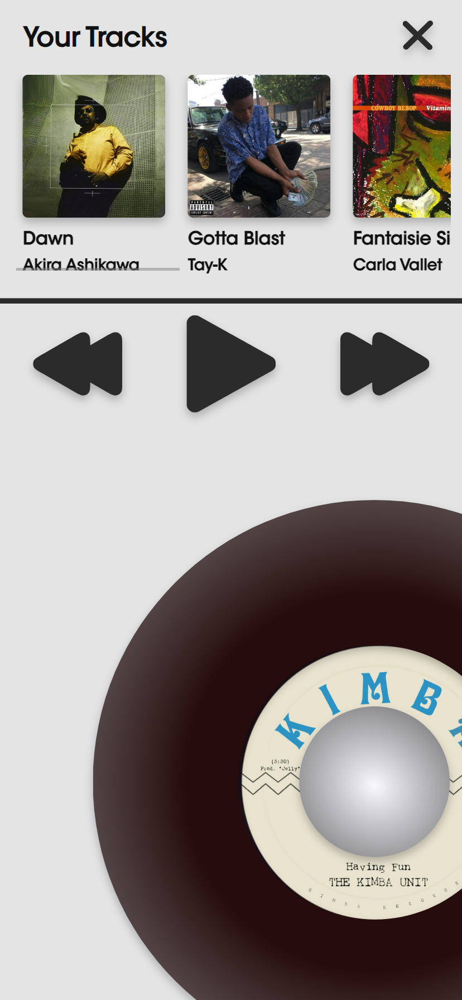
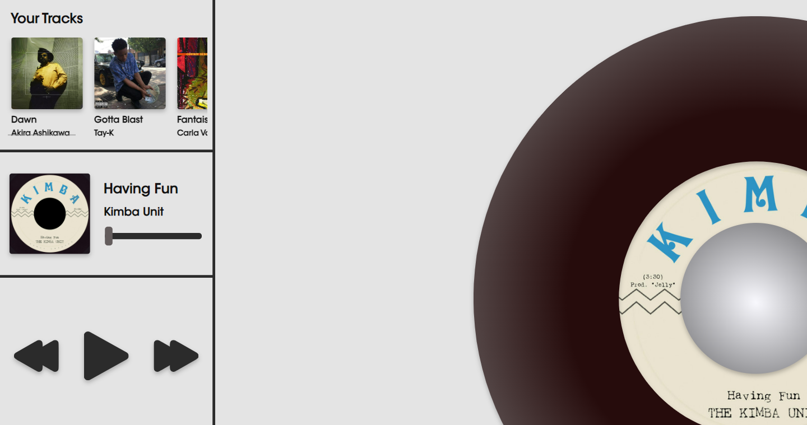

# Procesverslag
**Auteur:** Mats Renze Groot

**De opdrachten:** [opdracht 1](opdracht1/index.html) en [opdracht 2](opdracht2/index.html)

CONTROLS OPDRACHT 2!!!!!!!!!!!!!!!

Keys:
- Arrow Right: Next Song
- Arrow Left: Previous Song
- Space Bar: Pause & Play
- Enter: Enable Voice Commands

Voice Commands:
- Skip! : Next Song
- Back! : Previous Song
- Boring! : Next Song
- Scratch! : Next Song + Suprise
- Play! : Play song
- Pause!: Pause Song

Markdown is een simpele manier om HTML te schrijven.  
Markdown cheat cheet: [Hulp bij het schrijven van Markdown](https://github.com/adam-p/markdown-here/wiki/Markdown-Cheatsheet).

Nb. De standaardstructuur en de spartaanse opmaak van de README.md zijn helemaal prima. Het gaat om de inhoud van je procesverslag. Besteedt de tijd voor pracht en praal aan je website.

Nb. Door *open* toe te voegen aan een *details* element kun je deze standaard open zetten. Fijn om dat steeds voor de relevante stuk(ken) te doen.

## Bronnenlijst
  1. chat.openai.com
  2. https://developer.mozilla.org/en-US/docs/Web/CSS
  3. https://developer.mozilla.org/en-US/docs/Web/API/Web_Speech_API

## Opdracht 1 plan

  
uitwerken na schetsen idee (voor week 2)

  ### Je storyboard:
  

  ### Je ambitie: 
  Aan deze technieken/punten wil ik werken:
  - Ik wil een dynamische en minimalistische Animatie.
  - Ik wil dat deze animatie responsive is.
  - Ik wil dat de animatie slim werkt met het gebruik van Javascript genoteerd in ES6
  - Geen classes gebruiken en geen nieuwe containers
  - Een dark mode toevoegen.
 

## Opdracht 1 reflectie

  
uitwerken bij afronden opdracht (voor week 4)

  ### Je uitkomst - karakteristiek screenshot(s):
  

  
 
  

  
  ### Dit ging goed/Heb ik geleerd: 
  Korte omschrijving met plaatje(s)
  
  Op de regel met Maison Margiela zit een scroll animatie. De grenzen van deze animatie worden bepaald door een overflow. Ik had deze overflow eerst op de parent container staan, de h1, maar dit had helaas ook invloed op de animatie van het cijfertje. Die verdween namelijk, omdat deze buiten de breedte en in een latere iteratie de hoogte van de container bewoog tijdens zijn animatie. Ik heb dit gelukkig kunnen oplossen door middel van Javascript. Ik heb namelijk gebruik gemaakt van een combinatie van de Animationend eventlistener, een SetTimeout en een beetje DOM manipulatie om ervoor te zorgen dat de scroll animatie en de overflow die daar bij hoort pas afspelen nadat de animatie van het cijfertje eindigt.
   

  

  ### Dit was lastig/Is niet gelukt:
   
  Het gebruik van keyframes was eerst nog erg onintuitief voor mij, omdat je werkt met een een begin en eindresultaat gekoppeld aan bepaalde waarde in procenten. Alles tussen deze specifieke punten wordt automatisch geanimeerd, waardoor het voor mij soms nog wat verwarrend was. Ook was het gebruiken van meerdere transforms soms moeilijk omdat deze dan verkeerd genoteerd had in mijn CSS. Gelukkig heb ik dit later onder de knie gekregen.\
  
  
  
  

 

## Opdracht 2 plan

  
uitwerken na schetsen idee (voor week 5)

  ### Je ontwerp:
  

  
  

  ### Je ambitie: 
  Aan deze technieken/punten wil ik werken:
  - Ik wil Meerder files kunnen opslaan en oproepen gebaseerd op user input.
  - Ik wil dat ik animaties af kan laten spelen als feedback.
  - Ik wil dat Kan kiezen welke nummer hij af wilt spelen.
  - meerdere vormen van interactie.
  - ...

## Opdracht 2 test

  
uitwerken na testen (week 7)

  Neem minimaal 5 bevindingen op:

  ### Bevinding 1:

Responsivess op grotere Iphones (12 pro max >) laat de laptop layout zien ook als het scherm rechtop staat.

  #### oplossing:

Ik heb het minimum break point verhoogd van 400px naar 450px. 

  ### Bevinding 2:

  Voice commands zorgde voor veel crashes en performance issues op IOS devices. 

  #### oplossing:

  Ik heb de functie van de Voice Control functionaliteit nu in een keydown functie gezet. Deze functionaliteit is nu dus alleen beschikbaar op desktop 
  devices. De gebruiker moet nu op de enter knop drukken om Voice control (tijdelijk) aan te zetten. Ik heb er ook voor gekozen om het tijdelijke aspect te
  behouden om de VoiceRecognition anders te veel perfomance vraagt.

  ### Bevinding 3:

Het werkent maken van de skip forward and skip backward buttons.

  #### oplossing:

  Ik heb alle tracks in de array een specifieke waarde gegeven op basis van de numerieke volgorde waarin zij staan. 

Met gebruik van if else statements wordt er met javascript gekeken naar de waarde van de huidige track en op basis van user input wordt er dan +1 toegevoegd aan de track value. Dit gebeurd als de gebruiker op de skipForward button drukt. Deze hogere waarde staat dan gelijk aan de volgende track en deze wordt dan afgespeeld. Hetzelfde principe werkt ook voor de skipBackward, maar inplaats van + 1 doen we - 1.

 ### Bevinding 4:

 Display:grid voor responsiveness gebruiken.

  #### oplossing:

Ik had veel moeite met het overzetten van de layout naar de desktop versie van het ontwerp, ik gebruikte eerst eigenlijk alleen maar flexbox, maar na wat hulp 
van Sanne is mijn gridhaat nu volledig verdwenen. Met grid heb ik mijn pagina in vier secties verdeeld en op basis van de grootte van de viewport heeft elke sectie een aangegeven plek op het grid. Dit heeft gezorg voor een veel netter ontwerp en logischere CSS.

 ### Bevinding 5:

Specifity van CSS Selectoren verbeteren, omdat deze vaak door een eerdere selectoren werden overruled.

#### oplossing:

Ik ben naar Sanne toegestapt om te vragen hoe ik dit probleem moet oplossen ik heb met name geleerd over de de direct parent selector ">" en dat je een class kan combineren met een section:nth-of-type(n) of dergelijke om zo een krachtigere selector te hebben.
  

## Opdracht 2 reflectie

  
uitwerken bij afronden opdracht (voor week 8)

  ### Je uitkomst - karakteristiek screenshot(s):
  

  ### Dit ging goed/Heb ik geleerd: 

- Het gebruik maken van grid voor positioning and responsiveness.
- Het Gebruik maken van een API voor voice recognition en controls
- If Else statements gebruiken om door een array te navigeren.
- Dom manipulatie op basis van items binnen een Array
- Inheritance van CSS selectoren
- Dom manipulatie voor user Feedback

  ### Dit was lastig/Is niet gelukt:

Het mogelijk maken van voice commands op mobile devices. De performance impact van VC was te groot en liet de website te vaak crashen 
om het er in te houden. Ik wou het nog mogelijk maken door gebruik te maken van de "DeviceMotionEvent" maar de kreeg ik helaas niet aan de praat.

