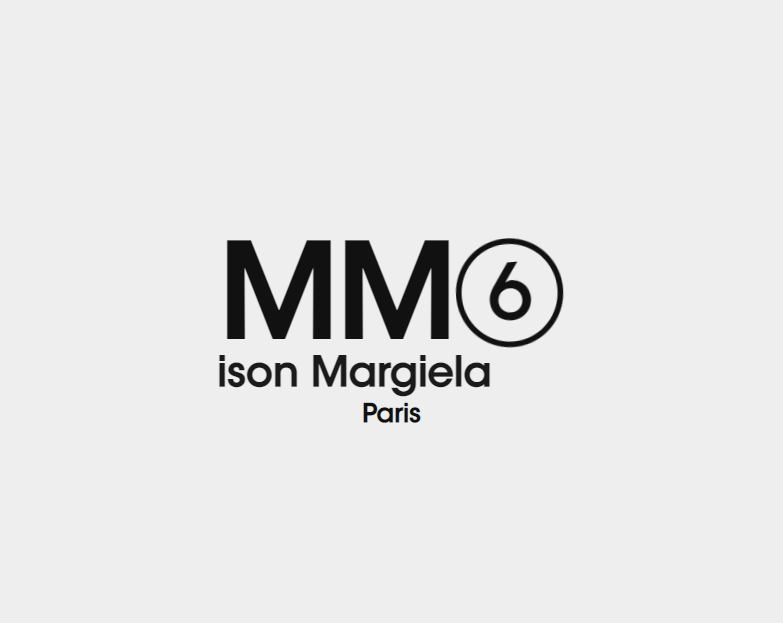
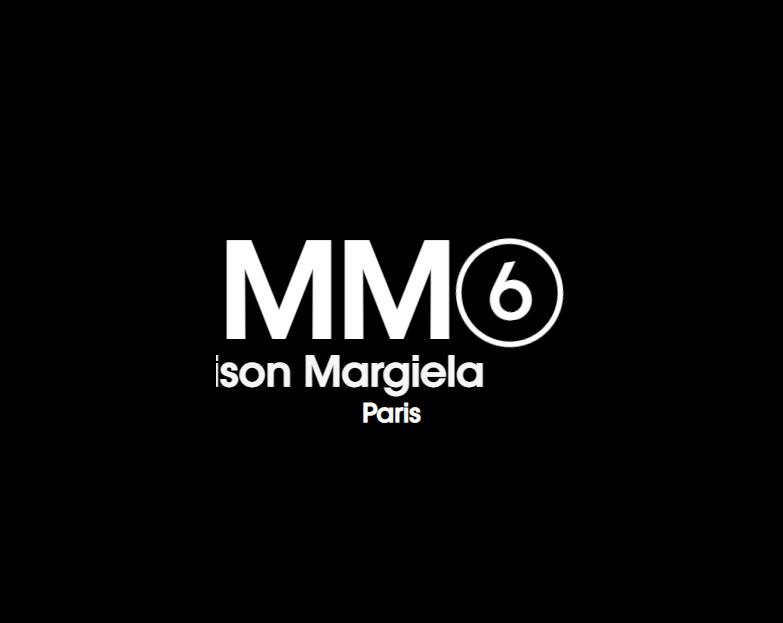
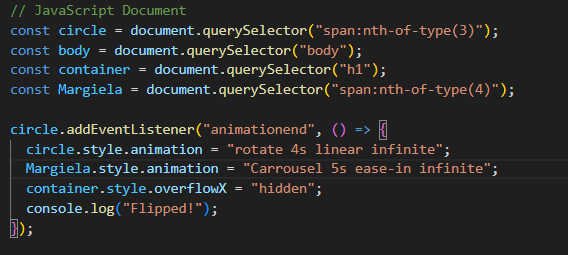

# Procesverslag
**Auteur:** Mats Renze Groot

**De opdrachten:** [opdracht 1](opdracht1/index.html) en [opdracht 2](opdracht2/index.html)

Markdown is een simpele manier om HTML te schrijven.  
Markdown cheat cheet: [Hulp bij het schrijven van Markdown](https://github.com/adam-p/markdown-here/wiki/Markdown-Cheatsheet).

Nb. De standaardstructuur en de spartaanse opmaak van de README.md zijn helemaal prima. Het gaat om de inhoud van je procesverslag. Besteedt de tijd voor pracht en praal aan je website.

Nb. Door *open* toe te voegen aan een *details* element kun je deze standaard open zetten. Fijn om dat steeds voor de relevante stuk(ken) te doen.

## Bronnenlijst
  1. chat.openai.com
  2. https://developer.mozilla.org/en-US/docs/Web/CSS
  3. -...-

## Opdracht 1 plan

  
uitwerken na schetsen idee (voor week 2)

  ### Je storyboard:
  

  ### Je ambitie: 
  Aan deze technieken/punten wil ik werken:
  - Ik wil een dynamische en minimalistische Animatie.
  - Ik wil dat deze animatie responsive is.
  - Ik wil dat de animatie slim werkt met het gebruik van Javascript genoteerd in ES6
  - Geen classes gebruiken en geen nieuwe containers
  - Een dark mode toevoegen.
 

## Opdracht 1 reflectie

  
uitwerken bij afronden opdracht (voor week 4)

  ### Je uitkomst - karakteristiek screenshot(s):
  

  
 
  

  
  ### Dit ging goed/Heb ik geleerd: 
  Korte omschrijving met plaatje(s)
  
  Op de regel met Maison Margiela zit een scroll animatie. De grenzen van deze animatie worden bepaald door een overflow. Ik had deze overflow eerst op de parent container staan, de h1, maar dit had helaas ook invloed op de animatie van het cijfertje. Die verdween namelijk, omdat deze buiten de breedte en in een latere iteratie de hoogte van de container bewoog tijdens zijn animatie. Ik heb dit gelukkig kunnen oplossen door middel van Javascript. Ik heb namelijk gebruik gemaakt van een combinatie van de Animationend eventlistener, een SetTimeout en een beetje DOM manipulatie om ervoor te zorgen dat de scroll animatie en de overflow die daar bij hoort pas afspelen nadat de animatie van het cijfertje eindigt.
   

  

  ### Dit was lastig/Is niet gelukt:
   
  Het gebruik van keyframes was eerst nog erg onintuitief voor mij, omdat je werkt met een een begin en eindresultaat gekoppeld aan bepaalde waarde in procenten. Alles tussen deze specifieke punten wordt automatisch geanimeerd, waardoor het voor mij soms nog wat verwarrend was. Ook was het gebruiken van meerdere transforms soms moeilijk omdat deze dan verkeerd genoteerd had in mijn CSS. Gelukkig heb ik dit later onder de knie gekregen.\
  
  
  
  

 

## Opdracht 2 plan

  
uitwerken na schetsen idee (voor week 5)

  ### Je ontwerp:
  

  ### Je ambitie: 
  Aan deze technieken/punten wil ik werken:
  - punt 1
  - punt 2
  - nog een punt
  - ...

## Opdracht 2 test

  
uitwerken na testen (week 7)

  Neem minimaal 5 bevindingen op:

  ### Bevinding 1:
  Omschrijving van wat er nog niet orde was (tekst en afbeeding(en)).

  #### oplossing:
  Beschrijving hoe je het hebt hebt opgelost of als het niet gelukt is hoe je het zou oplossen (tekst en afbeeding(en)).

  ### Bevinding 2:
  Omschrijving van wat er nog niet orde was (tekst en afbeeding(en)).

  #### oplossing:
  Beschrijving hoe je het hebt hebt opgelost of als het niet gelukt is hoe je het zou oplossen (tekst en afbeeding(en)).

  ### Bevinding 3:
  ...

## Opdracht 2 reflectie

  
uitwerken bij afronden opdracht (voor week 8)

  ### Je uitkomst - karakteristiek screenshot(s):
  

  ### Dit ging goed/Heb ik geleerd: 
  Korte omschrijving met plaatje(s)

  

  ### Dit was lastig/Is niet gelukt:
  Korte omschrijving met plaatje(s)

  

